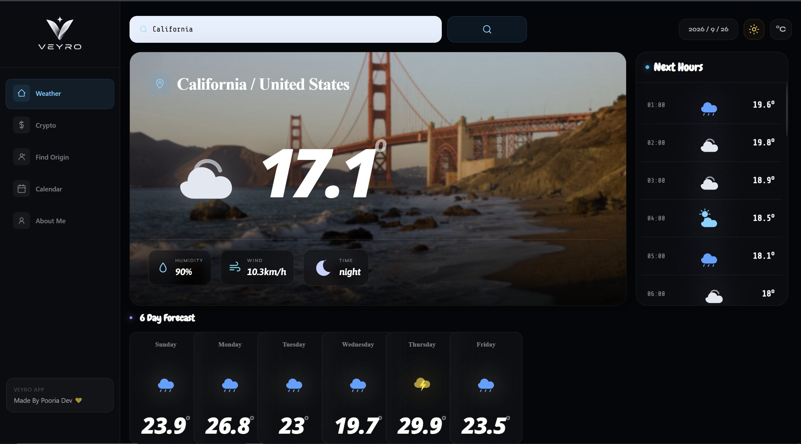
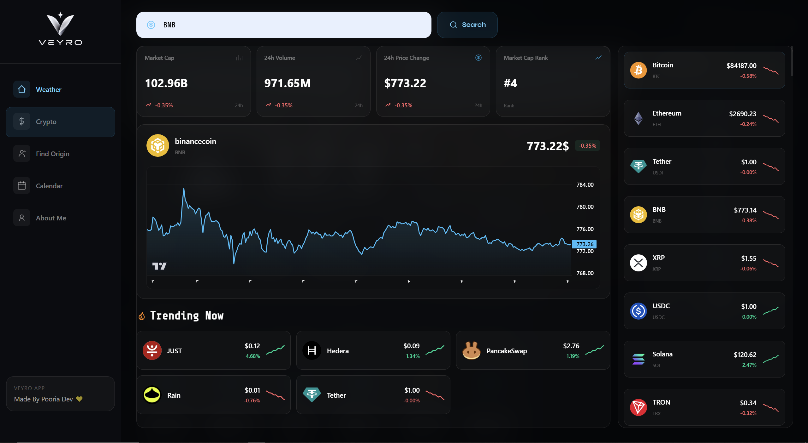
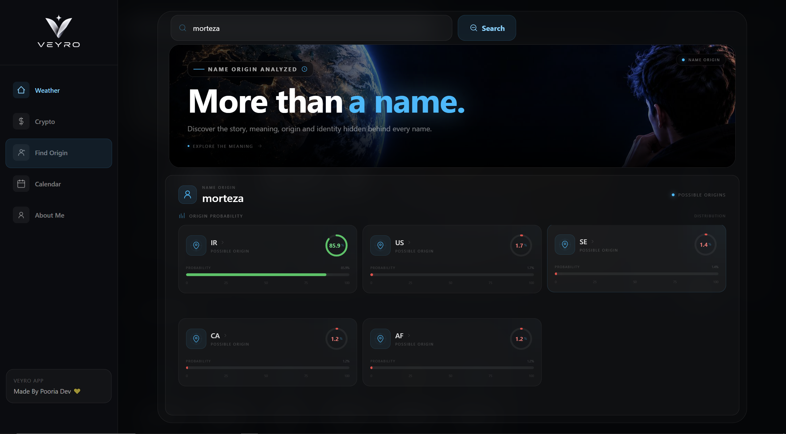
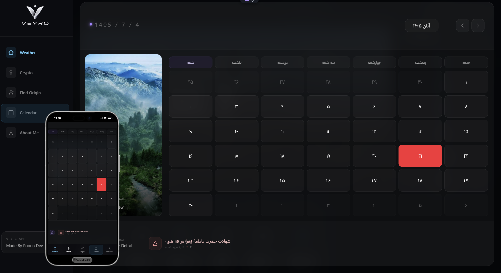
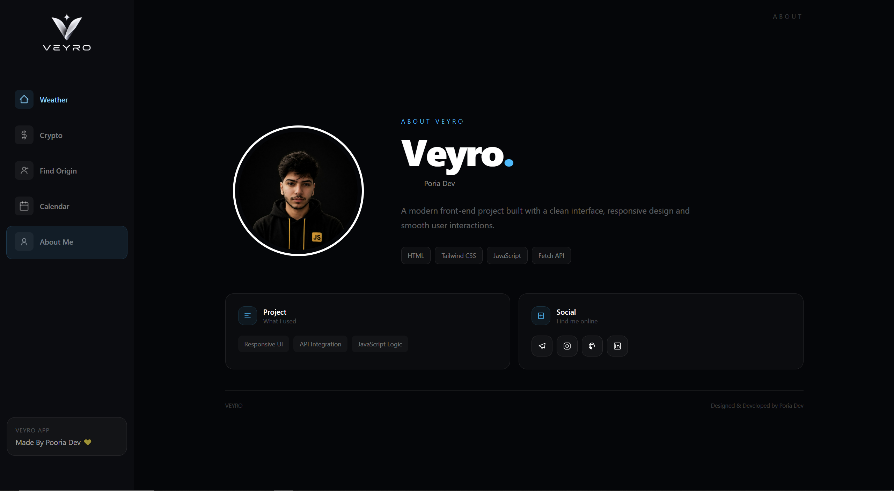

<div align="center">


### ⚡ A Modern Front-End Dashboard for Weather, Crypto, Origins & Time

<p>
  
  
  
  
  
  
</p>

<br>

<a href="https://poria-dev.github.io/FullApp/src">


</a>

<br><br>

<a href="https://poria-dev.github.io/FullApp/src">

### 🔗 Open Veyro Live

</a>

<br><br>

> **VEYRO** is a multi-purpose interactive dashboard designed around real-time data, API integration and a modern responsive interface.

</div>

---

# ✦ Veyro Showcase

<div align="center">



<br><br>



<br><br>



<br><br>



<br><br>



</div>

---

## ✦ Overview

**Veyro** is a modern front-end dashboard that combines several data-driven experiences inside one interface.

Instead of building a single-purpose application, Veyro brings multiple interactive tools together into one cohesive UI:

<table>
<tr>
<td width="50%">

### 🌦 Weather Intelligence

Search for cities and countries and view:

* Current temperature
* Weather condition
* Humidity
* Wind speed
* Day / Night state
* Hourly forecast
* 7-day forecast
* Dynamic weather SVG icons
* Dynamic location information

</td>

<td width="50%">

### ₿ Crypto Dashboard

Search and explore cryptocurrencies with:

* Current price
* Market cap
* Market cap rank
* 24h price change
* Volume information
* Trending assets
* Large market overview
* Interactive price chart

</td>
</tr>

<tr>
<td width="50%">

### 🧬 Name Origin

Enter a name and explore:

* Possible countries of origin
* Probability-based results
* Dynamic result cards
* Name-focused visual experience

</td>

<td width="50%">

### 📅 Persian Calendar

A dedicated Persian calendar experience with:

* Jalali date
* Persian month information
* Holiday states
* Daily events
* Previous / next month navigation
* Selected-day information

</td>
</tr>
</table>

---

# ✦ Why Veyro?

Veyro was designed around one idea:

<div align="center">

### **Make data-heavy interfaces feel simple, visual and premium.**

</div>

The project focuses heavily on:

```text
Clean Interface
        ↓
Responsive Layout
        ↓
API Integration
        ↓
Dynamic Rendering
        ↓
Interactive Components
        ↓
Real Data
```

---

# ✦ Features

## 🌦 Weather

Veyro uses location search and weather APIs to create a dynamic weather experience.

### Included

* 🔎 City / country search
* 📍 Location information
* 🌡 Current temperature
* 💧 Humidity
* 💨 Wind speed
* ☀️ Day / Night detection
* 🌤 Dynamic weather illustrations
* 🕒 Hourly forecast
* 📆 7-day forecast
* 🖼 Dynamic weather presentation
* ⚠️ Search validation
* ⏳ Loading state
* 🔔 Error / empty-result notification

---

## ₿ Crypto Market

The crypto section turns live market data into a visual dashboard.

### Included

* 🔎 Cryptocurrency search
* 💰 Current price
* 📊 Market cap
* 🏆 Market cap rank
* 📈 24-hour change
* 📉 Interactive price history
* 🔥 Trending assets
* 🪙 Large coin list
* 🖼 Coin logos
* 📌 Dynamic statistics cards
* 📐 Automatic number formatting

---

## 🧬 Name Origin Explorer

A separate experience inside Veyro is dedicated to name-origin analysis.

### Included

* 👤 Name search
* 🌍 Possible countries
* 📊 Probability visualization
* 🔎 Dynamic search
* 🧩 Result cards
* ✦ Visual data presentation

---

## 📅 Persian Calendar

Veyro also includes a Persian calendar system.

### Included

* 🇮🇷 Jalali dates
* 📆 Persian months
* ⬅ Previous month
* ➡ Next month
* 🎉 Holiday detection
* 📝 Event information
* 👆 Selected day details
* 🔄 Dynamic calendar rendering

---

# ✦ UI / UX

Veyro is built around a **dark premium dashboard aesthetic**.

### Design language

 Clean structure  Utility-first styling  Visual hierarchy  Dynamic interactions  Data visualization

The interface uses:

* Dark backgrounds
* Subtle transparency
* Backdrop blur
* Soft borders
* Sky / violet accent colors
* Rounded surfaces
* Dynamic hover states
* Responsive cards
* Animated loading states
* SVG-based interface icons

---

# ✦ Responsive Design

Veyro was designed to adapt between desktop and mobile rather than simply shrinking the desktop layout.

### Desktop

```text
┌──────────────────────────────────────────────────────────────┐
│ Sidebar │                 Main Dashboard                    │
│         │                                                    │
│         │     Data          Visualization       Cards       │
│         │                                                    │
└──────────────────────────────────────────────────────────────┘
```

### Mobile

```text
┌──────────────────────────────┐
│                              │
│       Main Experience        │
│                              │
│      Scrollable Content      │
│                              │
├──────────────────────────────┤
│ Weather │ Crypto │ Origin   │
│ Calendar │ About             │
└──────────────────────────────┘
```

---

# ✦ Technology Stack

<div align="center">

<table>
<tr>
<td align="center" width="140">


**HTML5**

</td>

<td align="center" width="140">


**Tailwind CSS**

</td>

<td align="center" width="140">


**JavaScript**

</td>

<td align="center" width="140">


**Web Platform**

</td>
</tr>

<tr>
<td align="center">


**CoinGecko**

</td>

<td align="center">


**Lightweight Charts**

</td>

<td align="center">


**GitHub**

</td>

<td align="center">


**REST APIs**

</td>
</tr>
</table>

</div>

---

# ✦ Technical Highlights

### ⚡ Vanilla JavaScript

Veyro is built without React, Vue or another JavaScript framework.

The project relies on:

```js
fetch()
async / await
Promise
Promise.all()
then()
catch()
finally()
DOM manipulation
classList
template literals
event listeners
```

---

### 🎨 Tailwind CSS

The UI is built with utility-first Tailwind classes.

Examples of the visual system include:

```text
bg-white/[0.025]
border-white/10
backdrop-blur-xl
rounded-2xl
transition-all
hover:bg-white/[0.045]
```

---

### 📊 Dynamic Charts

Crypto price history is visualized with **Lightweight Charts**.

```text
API Response
     ↓
Price Array
     ↓
Timestamp Conversion
     ↓
Chart Data
     ↓
Interactive Visualization
```

---

### 🔄 Dynamic DOM Rendering

Veyro generates several parts of the UI dynamically from API responses.

This includes:

* Weather cards
* Forecast cards
* Cryptocurrency cards
* Market statistics
* Trending assets
* Calendar cells
* Name-origin results

---

# ✦ APIs & Services

| Service                       | Purpose                                        |
| ----------------------------- | ---------------------------------------------- |
| 🌦 **Open-Meteo Geocoding**   | Convert city / country names into coordinates  |
| 🌤 **Open-Meteo Forecast**    | Weather, wind, humidity, hourly and daily data |
| ₿ **CoinGecko API**           | Cryptocurrency search and market data          |
| 📈 **CoinGecko Market Chart** | Historical crypto price data                   |
| 🧬 **Nationalize API**        | Name-origin probability data                   |
| 📅 **Persian Calendar API**   | Jalali calendar, holidays and events           |
| 📊 **Lightweight Charts**     | Interactive crypto price visualization         |

---

# ✦ Architecture

```text
VEYRO
│
├── 🌦 Weather
│   ├── City Search
│   ├── Geocoding
│   ├── Current Weather
│   ├── Hourly Forecast
│   └── 7-Day Forecast
│
├── ₿ Crypto
│   ├── Coin Search
│   ├── Market Data
│   ├── Trending
│   ├── Coin List
│   └── Interactive Chart
│
├── 🧬 Name Origin
│   ├── Name Search
│   ├── Probability
│   └── Country Results
│
├── 📅 Calendar
│   ├── Jalali Date
│   ├── Month Navigation
│   ├── Holidays
│   └── Events
│
└── 👤 About
    └── Developer Profile
```

---

# ✦ Interaction System

### Search states

```text
Idle
 ↓
Validation
 ↓
Loading
 ↓
API Request
 ↓
Success / Error
```

### Navigation

Desktop:

```text
Sidebar
   ↓
Active Indicator
   ↓
Section
```

Mobile:

```text
Bottom Navigation
        ↓
Active Slider
        ↓
Section
```

---

# ✦ Data Flow

```text
             USER
               │
               ▼
        ┌──────────────┐
        │ Search / UI  │
        └──────┬───────┘
               │
               ▼
          Fetch API
               │
       ┌───────┼────────┐
       │       │        │
       ▼       ▼        ▼
   Weather   Crypto   Origin
       │       │        │
       └───────┼────────┘
               │
               ▼
        JavaScript Logic
               │
               ▼
       Dynamic DOM Update
               │
               ▼
          Veyro UI
```

---

# ✦ Error Handling

The interface includes user-facing error states rather than silently failing.

Examples:

* ❌ Invalid search
* ❌ No weather result
* ❌ Crypto search error
* ⏳ Loading state
* 🔔 Warning notification
* 🔄 UI reset after request

---

# ✦ Performance & UX Details

* ⚡ Lightweight Vanilla JavaScript
* 🎯 Component-focused DOM rendering
* 📱 Responsive layouts
* 🖥 Desktop navigation
* 📱 Mobile navigation
* 🧊 Backdrop blur effects
* 🎨 SVG interface icons
* 🔄 Dynamic data rendering
* ⏳ Loading indicators
* 🔔 Toast notifications
* 📊 Interactive visualization
* 🧩 Reusable UI patterns

---

# ✦ Getting Started

Clone the repository:

```bash
git clone https://github.com/poria-dev/FullApp.git
```

Open the project:

```bash
cd FullApp
```

Then run the project using a local server such as **Live Server**.

### 🚀 Live Demo

**https://poria-dev.github.io/FullApp/src**

---

# ✦ Project Structure

```text
FullApp/
│
├── src/
│   │
│   ├── index.html
│   │
│   ├── style/
│   │   └── output.css
│   │
│   ├── js/
│   │   └── ...
│   │
│   └── img/
│       ├── file_00000000af8481f49b4c34e21a3fe973-removebg-preview.png
│       ├── shat1veyro.png
│       ├── shat2veyro.png
│       ├── shat3veyro.png
│       ├── shat4veyro.png
│       └── shat5veyro.png
│
└── README.md
```

---

# ✦ Live Experience

<div align="center">

## 🚀 Ready to explore Veyro?

<a href="https://poria-dev.github.io/FullApp/src">


</a>

<br><br>

**Experience the project directly in your browser.**

</div>

---

# ✦ Developer

<div align="center">


# Poria Rezaee

### Front-End Developer

I build modern web interfaces with a focus on:

```text
Responsive Design
      +
JavaScript
      +
API Integration
      +
UI / UX
      +
Creative Front-End
```

<br>

<a href="https://poria-dev.github.io/FullApp/src">

</a>

<a href="https://github.com/poria-dev">

</a>

<a href="https://linkedin.com/in/pooria-rezaee">

</a>

<a href="https://instagram.com/poria.frontend">

</a>

<a href="https://t.me/pori_07">

</a>

</div>

---

# ✦ Veyro in One Sentence

<div align="center">

### **One interface. Multiple worlds. Real data. Pure front-end.**

<br>

### 🌦 Weather  •  ₿ Crypto  •  🧬 Origins  •  📅 Calendar

</div>

---

<div align="center">

### Built with ⚡ by Poria Dev


</div>


